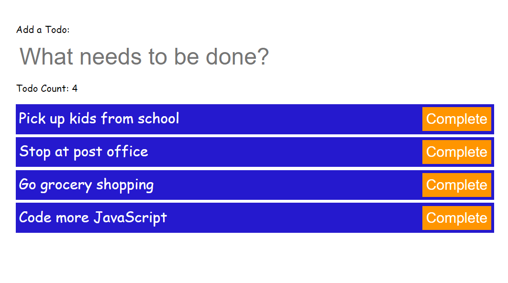

# JS-Todo-List

JavaScript Todo List

<!-- Live link to deployed app -->

Repository: https://github.com/Mdudzik92/JS-Todo-List 
Deployed app: https://mdudzik92.github.io/JS-Todo-List/

<!-- Technologies used -->

JavaScript, HTML, CSS, Local Storage

<!-- Explanation of what the app is -->

This is a todo app made with JavaScript which saves the user entered todos on the document, updating the todos list with the persisted data from local storage. Includes complete buttons which remove the data from local storage.

<!-- Screenshot -->

<!-- License -->

MIT

<!-- Contact information -->

Email: mdudzik92@gmail.com
